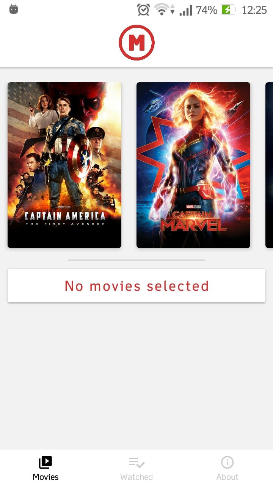
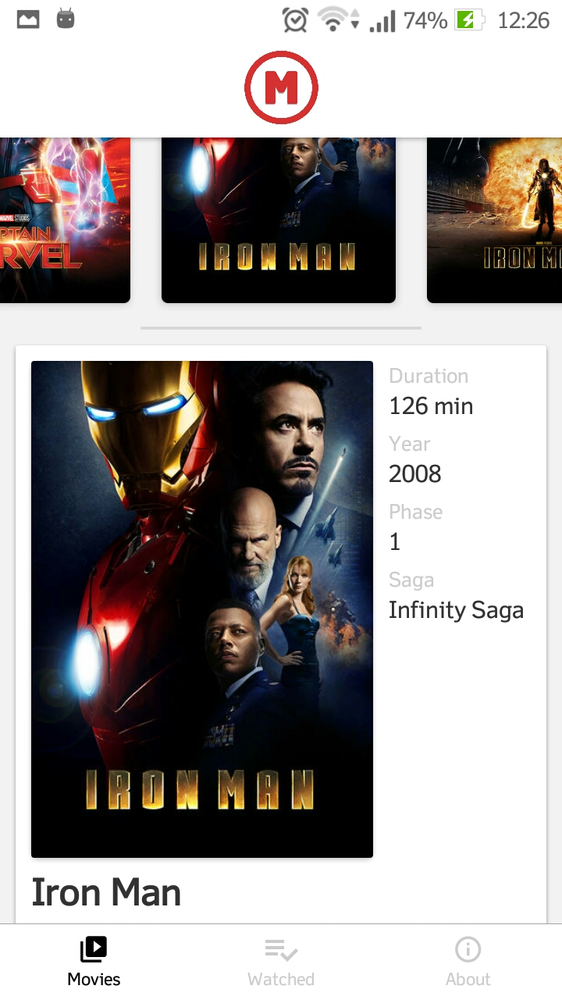
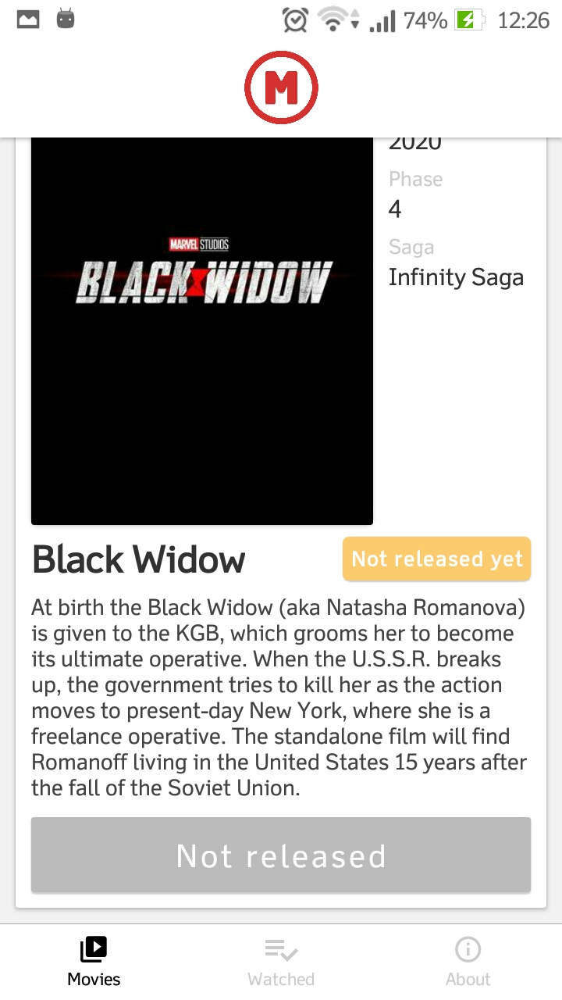
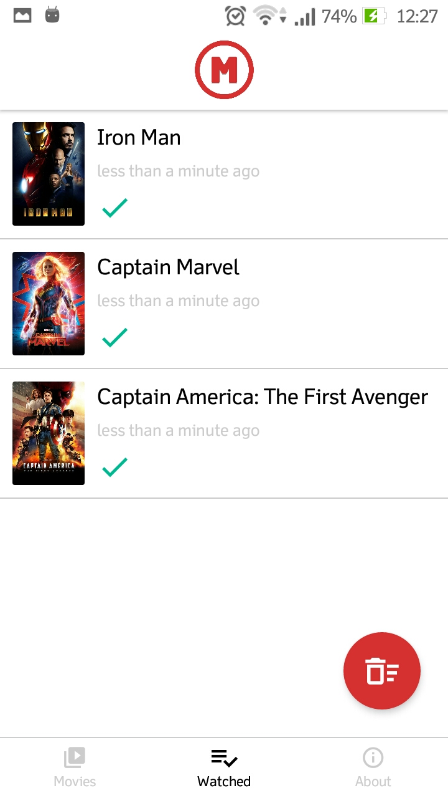
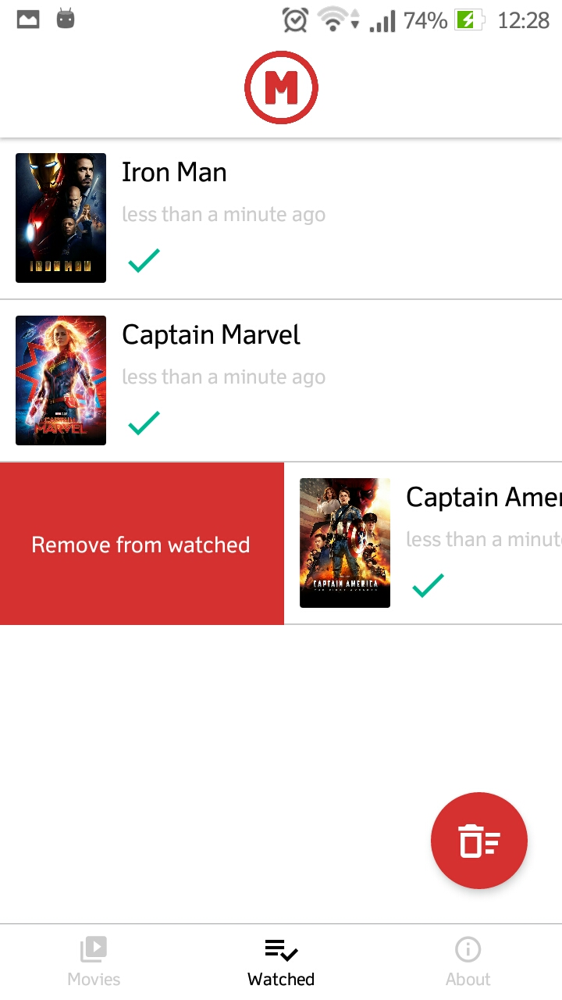
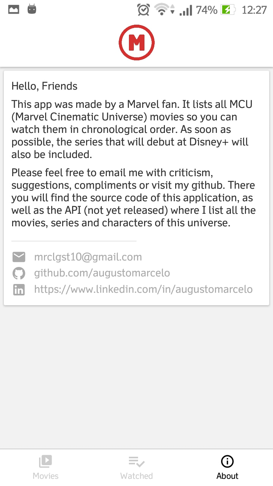

<h1 align="center">
  
</h1>

ChronoMarvel uses MCUAPI to retrieve all movies and list them in chronological order. The app doesn't let you watch movies, just lists them and lets you manage which ones have been watched.

## Prototype Previews

  
  
  
  
  
  
  

## Used Technologies and Resources
 - React Native
 - Hooks
 - Reactotron
 - Pull to Refresh
 - Swipe to Remove Items
 - Bottom Navigation
 - RealmDB
